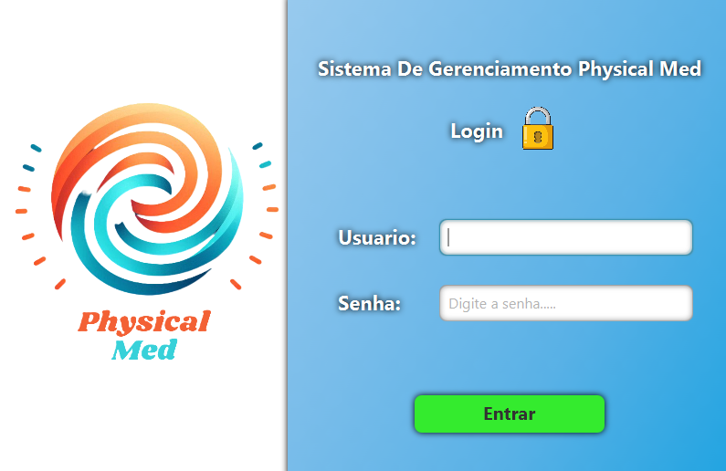

# PhysicalMedManagement 🏥

O **PhysicalMedManagement** é um sistema desktop desenvolvido em **Java** com foco no gerenciamento de uma **empresa real de pequeno porte** da área de produtos médicos/fisioterapia.  
O sistema centraliza o controle de **estoque**, **vendas**, **pagamentos**, **taxas de maquininhas** e **vendedores**, oferecendo uma interface simples e funcional para o uso diário.

O projeto foi desenvolvido com foco em organização de código, separação de responsabilidades e facilidade de manutenção.

---

## 🚀 Funcionalidades

- Autenticação de usuários (login)
- Tela administrativa para gerenciamento do sistema
- Cadastro, edição e listagem de produtos
- Controle de estoque
- Registro e gerenciamento de vendas
- Gerenciamento de pagamentos
- Controle de taxas de maquininhas
- Atualização e exclusão de registros
- Interface gráfica construída com JavaFX

---

## 🛠️ Tecnologias Utilizadas

- **Java**
- **JavaFX** (Interface gráfica)
- **Maven** (Gerenciamento de dependências)
- **PostgreSQL** (Banco de dados)
- **JDBC**

---

## 📂 Estrutura do Projeto
```markdown
PhysicalMedManagement
├── pom.xml
├── src
│   ├── main
│   │   ├── java
│   │   │   ├── Login.java
│   │   │   ├── AdminScreen.java
│   │   │   ├── ProductMenu.java
│   │   │   ├── PaymentMenu.java
│   │   │   ├── SaleUpdate.java
│   │   │   ├── SaleAdd.java
│   │   │   ├── ProductAdd.java
│   │   │   ├── ProductUpdate.java
│   │   │   ├── PaymentAdd.java
│   │   │   ├── PaymentUpdate.java
│   │   │   ├── LoginController.java
│   │   │   ├── AdminScreenController.java
│   │   │   ├── ProductMenuController.java
│   │   ├── resources
│   │   │   ├── application.properties
│   │   │   ├── static
│   │   │   ├── templates
│   ├── test
│   │   ├── java
│   │   │   ├── LoginTest.java
│   │   │   ├── AdminScreenTest.java
│   │   │   ├── ProductMenuTest.java
│   │   │   ├── PaymentMenuTest.java
│   │   │   ├── SaleUpdateTest.java
│   │   │   ├── SaleAddTest.java
│   │   │   ├── ProductAddTest.java
│   │   │   ├── ProductUpdateTest.java
│   │   │   ├── PaymentAddTest.java
│   │   │   ├── PaymentUpdateTest.java
│   │   ├── resources
│   │   │   ├── test.properties
│   │   │   ├── static
│   │   │   ├── templates
├── target
│   ├── PhysicalMedManagement.jar
│   ├── test-classes
│   ├── surefire-reports
```

---

## 🖼️ Screenshots do Sistema

<p align="center">
  
  
</p>
